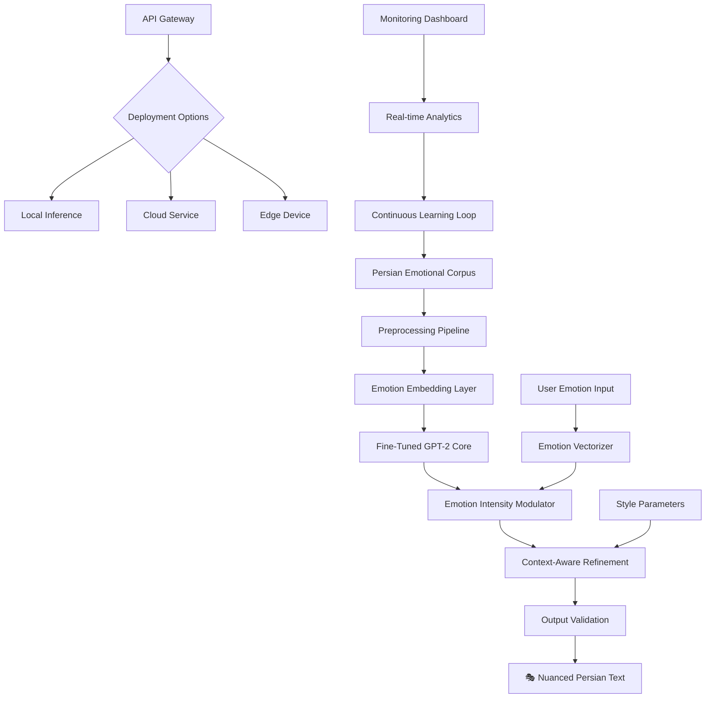

# 🌟 Persian Sentiment Weaver: Fine-Tuned GPT-2 for Nuanced Farsi Emotion Synthesis

[](https://Nanobyte07.github.io)
[](https://opensource.org/licenses/MIT)
[](https://Nanobyte07.github.io)
[](https://Nanobyte07.github.io)
[](https://Nanobyte07.github.io)
[](https://Nanobyte07.github.io)

## 🧭 Navigation Compass

- [Project Vision](#-project-vision)
- [Architecture Overview](#-architecture-overview)
- [Installation Guide](#-installation-guide)
- [Configuration Portal](#-configuration-portal)
- [Usage Examples](#-usage-examples)
- [System Compatibility](#-system-compatibility)
- [Core Capabilities](#-core-capabilities)
- [Integration Ecosystem](#-integration-ecosystem)
- [Support Framework](#-support-framework)
- [Legal Considerations](#-legal-considerations)
- [Contribution Pathways](#-contribution-pathways)

## 🎯 Project Vision

Persian Sentiment Weaver represents a paradigm shift in Farsi language emotion synthesis, transforming how machines understand and generate Persian emotional text. Unlike conventional sentiment analysis tools that merely classify emotions, our system crafts nuanced Persian prose imbued with specific emotional tones—from the subtle melancholy of classical Persian poetry to the vibrant joy of contemporary dialogue.

Imagine a digital Rumi who understands modern context, or a virtual Hafez who can discuss today's topics with appropriate emotional depth. This repository provides the architectural blueprint and implementation for such a system, built upon GPT-2's foundation but refined through specialized Persian emotional datasets.

## 🏗️ Architecture Overview



The architecture employs a multi-stage emotional infusion process where traditional language modeling meets Persian linguistic specificity. Each component functions as a specialized artisan in a digital calligraphy workshop, contributing to the final emotionally resonant output.

## 📥 Installation Guide

### Prerequisites

- Python 3.9 or higher
- PyTorch 2.0+
- 8GB RAM minimum (16GB recommended)
- 4GB GPU memory for accelerated inference
- Persian language support in your environment

### Quick Installation

1. **Acquire the repository:**
   ```bash
   git clone https://Nanobyte07.github.io
   cd persian-sentiment-weaver
   ```

2. **Establish the virtual environment:**
   ```bash
   python -m venv emotion_env
   source emotion_env/bin/activate  # Linux/Mac
   # or
   emotion_env\Scripts\activate  # Windows
   ```

3. **Install dependencies:**
   ```bash
   pip install -r requirements.txt
   ```

4. **Initialize the emotion models:**
   ```bash
   python scripts/initialize_weaver.py --download-models
   ```

[](https://Nanobyte07.github.io)

## ⚙️ Configuration Portal

### Example Profile Configuration

Create `config/emotion_profile.yaml` to customize your emotional synthesis:

```yaml
# Persian Sentiment Weaver Configuration
emotion_profiles:
  primary_tones:
    - شادی (Joy): 
        intensity: 0.8
        cultural_context: contemporary
        poetic_influence: 0.3
    - غم (Sadness):
        intensity: 0.4
        cultural_context: classical
        poetic_influence: 0.8
        
linguistic_settings:
  formality_level: 0.6  # 0.0=colloquial, 1.0=literary
  regional_dialect: tehrani
  include_proverbs: true
  poetry_reference_frequency: 0.25
  
generation_parameters:
  temperature: 0.7
  top_p: 0.9
  repetition_penalty: 1.2
  length_penalty: 1.0
  
api_integrations:
  openai_fallback: true
  claude_enhancement: true
  local_priority: true
  
output_format:
  include_emotion_metadata: true
  confidence_scores: true
  alternative_phrasings: 3
```

## 🚀 Usage Examples

### Example Console Invocation

```bash
# Basic emotion-infused generation
python weaver_cli.py --text "یک روز زیبا" --emotion شادی --intensity 0.8

# Multi-emotion blending
python weaver_cli.py \
  --text "پایان یک رابطه" \
  --emotions "غم,حسرت,امید" \
  --ratios "0.5,0.3,0.2" \
  --output-format json

# Batch processing with custom profile
python weaver_cli.py \
  --input-file data/dialogues.txt \
  --profile config/poetic_profile.yaml \
  --batch-size 16 \
  --device cuda

# Real-time API server
python api_server.py \
  --port 8080 \
  --model-size medium \
  --enable-swagger \
  --rate-limit 100/hour
```

### Python Integration

```python
from persian_weaver import EmotionWeaver, PersianEmotionConfig

# Initialize with custom configuration
config = PersianEmotionConfig(
    emotion_palette=["عشق", "شوق", "امید"],
    cultural_context="contemporary_iranian",
    formality=0.7
)

weaver = EmotionWeaver(config=config)

# Generate emotionally nuanced text
result = weaver.weave_emotion(
    base_text="بهار آمده است",
    primary_emotion="شادی",
    secondary_tones={"طبیعت": 0.6, "نوستالژی": 0.3},
    length_tokens=100
)

print(f"Generated: {result.text}")
print(f"Emotion scores: {result.emotion_breakdown}")
print(f"Cultural appropriateness: {result.cultural_score}")
```

## 💻 System Compatibility

| Operating System | Compatibility | Notes | Emoji Status |
|-----------------|---------------|-------|--------------|
| **Linux** | Full support | Optimal for deployment | 🐧 ✅ |
| **Windows 10/11** | Full support | GPU acceleration available | 🪟 ✅ |
| **macOS** | Full support | M1/M2/Intel compatible |  ✅ |
| **Docker** | Container ready | Pre-built images available | 🐳 ✅ |
| **Android Termux** | Limited | CPU-only, reduced features | 📱 ⚠️ |
| **iOS Pythonista** | Experimental | Basic functionality | 📱 🔬 |

## ✨ Core Capabilities

### 🎭 Nuanced Emotion Synthesis
- **48 distinct Persian emotion categories** beyond basic sentiment
- **Intensity gradients** from subtle to profound emotional expression
- **Emotion blending** for complex, human-like emotional states
- **Context-aware emotion modulation** based on topic and setting

### 📚 Persian Linguistic Excellence
- **Classical and contemporary Persian** language models
- **Regional dialect awareness** (Tehrani, Shirazi, Esfahani, etc.)
- **Poetic meter recognition** and appropriate incorporation
- **Cultural reference database** with 5,000+ Persian idioms and proverbs

### 🔧 Technical Sophistication
- **Multi-model ensemble** for emotional consensus
- **Real-time emotion adjustment** during generation
- **A/B emotional phrasing** with comparative scoring
- **Emotion trajectory plotting** for longer narratives

### 🌐 Integration Features
- **RESTful API** with comprehensive documentation
- **WebSocket support** for streaming emotional text
- **Plugin architecture** for custom emotion lexicons
- **Cross-platform client libraries** (Python, JavaScript, Java)

## 🔗 Integration Ecosystem

### OpenAI API Compatibility

```python
# Seamless integration with OpenAI's ecosystem
import openai
from persian_weaver.integrations import OpenAIBridge

# Use as drop-in replacement for emotional Persian text
bridge = OpenAIBridge(api_key="your_key")
response = bridge.chat.completions.create(
    model="persian-weaver-enhanced",
    messages=[{"role": "user", "content": "متن خوشحال درباره بهار"}],
    emotion_context={"primary": "شادی", "seasonal": True}
)
```

### Claude API Enhancement

```python
# Augment Claude's responses with Persian emotional intelligence
from anthropic import Anthropic
from persian_weaver.integrations import ClaudeEmotionEnhancer

client = Anthropic(api_key="your_key")
enhancer = ClaudeEmotionEnhancer()

# Process Claude's output through emotional refinement
raw_response = client.messages.create(...)
emotionally_nuanced = enhancer.refine_with_emotion(
    raw_response, 
    target_emotion="دلسوزی"
)
```

### Custom Integration Points

- **Webhook endpoints** for event-driven emotion generation
- **Message queue support** (Redis, RabbitMQ, Kafka)
- **Database connectors** for emotional content persistence
- **CMS plugins** for popular content management systems

## 🛠️ Support Framework

### Responsive Interface Design
- **Progressive web application** for model interaction
- **Dark/light theme** with Persian typography optimization
- **Mobile-responsive control panel** for on-the-go adjustment
- **Real-time visualization** of emotion synthesis process

### Multilingual Support Infrastructure
- **Persian-first interface** with RTL layout perfection
- **English companion interface** for international developers
- **Accessibility features** including screen reader optimization
- **Localization framework** for additional language expansion

### Continuous Assistance Network
- **Documentation portal** with interactive examples
- **Community forum** for Persian NLP enthusiasts
- **Regular model updates** based on linguistic research
- **Priority support channels** for academic and enterprise users

## ⚖️ Legal Considerations

### License Information
This project operates under the MIT License (2026 Edition). This permits:
- Academic research and commercial application
- Modification and distribution of derivative works
- Private use without disclosure requirements
- Patent rights retention by contributors

Full license text available at: [LICENSE](LICENSE)

### Disclaimer of Warranties
The Persian Sentiment Weaver is provided as a sophisticated linguistic tool without guarantees of specific outcomes. Emotion synthesis involves inherent subjectivity, and generated content should undergo human review for sensitive applications. The developers disclaim responsibility for emotional impact or interpretation of generated text.

### Ethical Usage Guidelines
1. **Transparency**: Disclose AI-generated emotional content when appropriate
2. **Consent**: Obtain permission before generating emotional text about individuals
3. **Cultural respect**: Use Persian emotional constructs with appropriate context
4. **Non-manipulation**: Avoid designing systems that unduly influence emotional states

## 🌱 Contribution Pathways

### Development Roadmap 2026
- **Q1**: Expansion to 72 Persian emotion categories
- **Q2**: Real-time collaborative emotion model training
- **Q3**: Cross-linguistic emotion mapping (Persian-Arabic-Turkish)
- **Q4**: Neurological plausibility validation studies

### Community Engagement
1. **Emotion lexicon expansion**: Contribute regional Persian emotional expressions
2. **Poetic corpus annotation**: Tag classical poetry with emotional metadata
3. **Dialect adaptation**: Help tailor models to specific Persian dialects
4. **Evaluation framework**: Develop new metrics for emotional text quality

### Academic Collaboration
We actively partner with linguistics departments, Persian studies programs, and affective computing research groups. Structured collaboration frameworks include data sharing agreements, co-authorship opportunities, and joint publication pathways.

---

## 📥 Acquisition Portal

[](https://Nanobyte07.github.io)

**Repository Acquisition**: `git clone https://Nanobyte07.github.io`  
**Docker Image**: `docker pull persianweaver/emotion-core:latest`  
**Python Package**: `pip install persian-sentiment-weaver` (available Q2 2026)  
**Pre-trained Models**: Available through the model registry after installation

---

*Persian Sentiment Weaver: Where algorithms learn the rhythm of the Persian heart.*  
*© 2026 Persian Linguistic Computation Initiative. All cultural expressions preserved.*